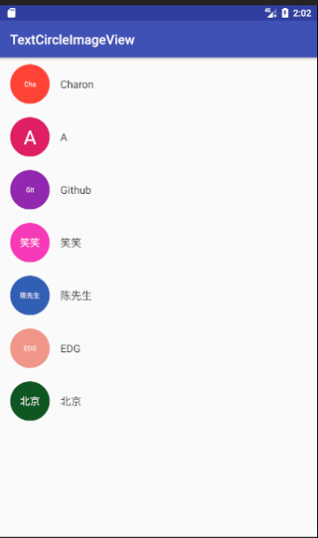

# TextCircleImageView

## 简介
将CircleView和Text结合，适用于多种场景使用

## 功能
####V1.0.0
1. 自定义背景，文字颜色
2. 支持3字以内的文字
3. 支持设定颜色集

####V1.0.1
1. 消除小bug
2. 调整字体大小
## 预览

单文字效果

多文字效果


## 使用

```

<nexuslink.charon.textcircleimageview.TextCircleImageView
        android:id="@+id/item_img"
        android:layout_margin="16dp"
        app:text="Charon"
        app:backgroundColor="@color/colorAccent"
        app:textColor="@color/colorPrimary"
        app:first="true"
        android:layout_width="60dp"
        android:layout_height="60dp"
        android:layout_gravity="center_vertical" />

```
xml使用

```

//设置文字
textCircleImageView.setText(“Charon”);

//使用默认的背景颜色
textCircleImageView.setDefaultBackgroundColor(position);

//使用自定义的颜色列表
textCircleImageView.setColorList(colorList);

//是否只显示首字
textCircleImageView.setFirst(true);

```

## 引入
### gradle
第一步 在工程的gradle下添加如下信息

```

	allprojects {
		repositories {
			...
			maven { url 'https://jitpack.io' }
		}
	}

```
	
第二步 在项目的gradle 添加如下信息

```

	dependencies {
	        compile 'com.github.Charon1997:TextCircleImageView:1.0.1'
	}


```
	
### maven

第一步

```

	<repositories>
		<repository>
		    <id>jitpack.io</id>
		    <url>https://jitpack.io</url>
		</repository>
	</repositories>

```
第二步

```

	<dependency>
	    <groupId>com.github.Charon1997</groupId>
	    <artifactId>TextCircleImageView</artifactId>
	    <version>1.0.1</version>
	</dependency>

```

我的主页：[http://chenken.top](http://chenken.top)

欢迎和大家一起交流。
